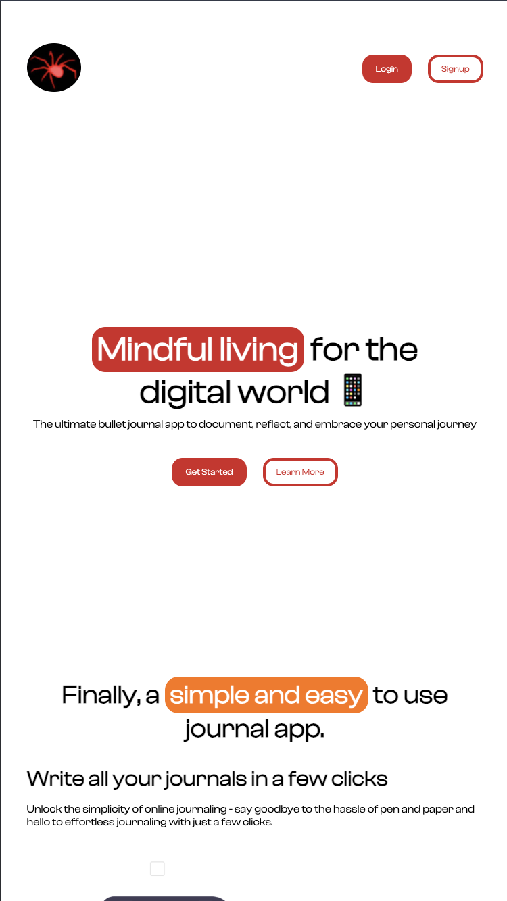
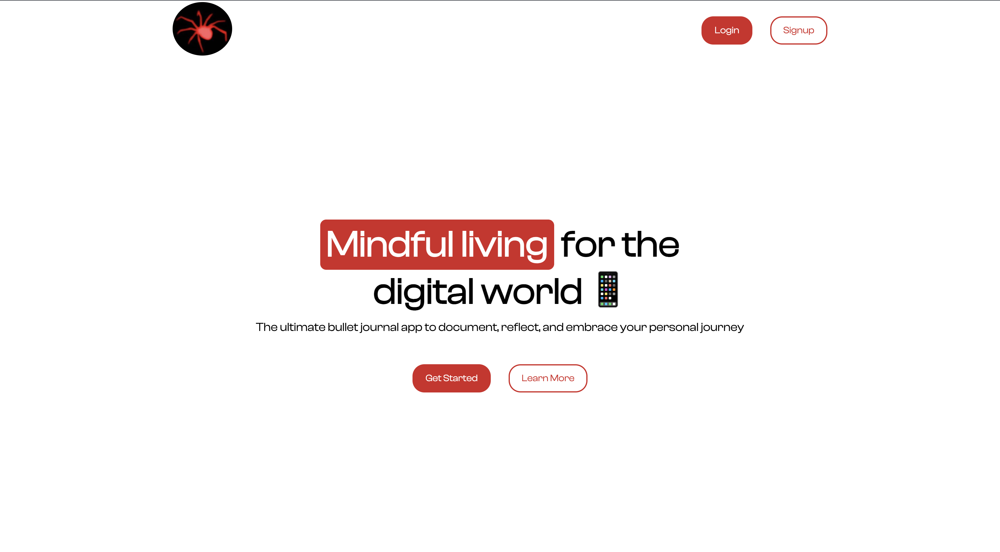
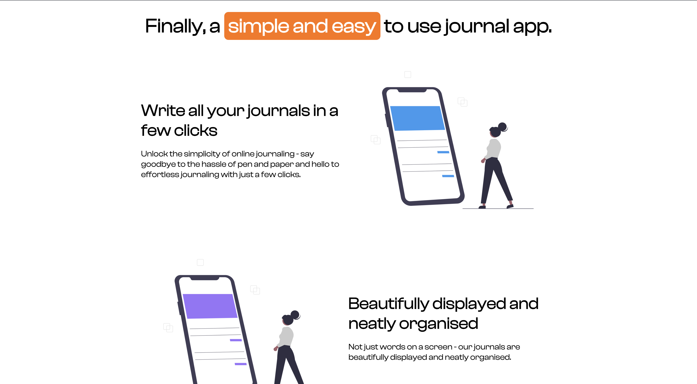
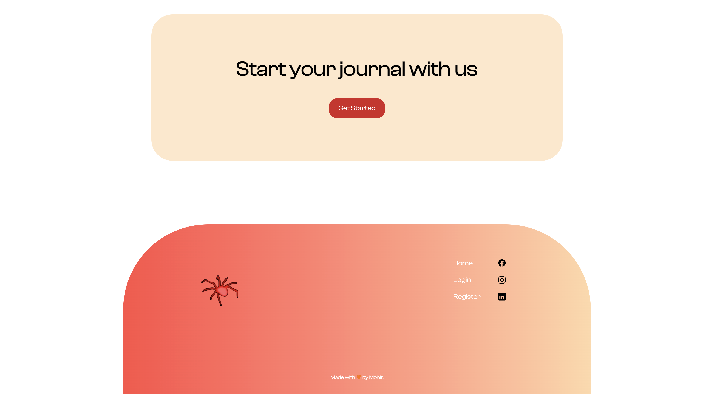

# 📔 Journal App

A **modern, fully responsive Journal App** built using only **HTML and CSS**.
Designed for users who want a clean, minimal, and distraction-free interface to jot down their daily thoughts or notes.

---

## 🌟 Features

✅ **Fully Responsive** — Works seamlessly across all screen sizes (mobile, tablet, desktop).
✅ **Modern UI Design** — Clean typography and subtle animations for a pleasant writing experience.
✅ **Lightweight** — Pure HTML + CSS, no frameworks or JavaScript used.
✅ **User-Friendly Layout** — Simple structure for journaling or diary-like notes.
✅ **Cross-Browser Compatible** — Tested on Chrome, Edge, and Firefox.

---

## 🖼️ Screenshots

### 📱 Mobile View


### 🏠 Home Page


### 📄 Journal Entry Page


### 📄 Journal Entry Page


---

## 🧩 Tech Stack

| Technology | Purpose |
|-------------|----------|
| **HTML5** | Structure & Content |
| **CSS3** | Styling, Layout, and Responsiveness |
| **Flexbox & Grid** | Used for responsive layouts |

---

## 🚀 Getting Started

1. **Clone this repository**
   ```bash
   git clone https://github.com/yourusername/journal-app.git

2. **Open the project folder**
   ```bash
   cd journal-app

3. **Run the project**
    Simply open the index.html file in your browser.

🧱 Folder Structure

journal-app/
├── index.html
├── style.css
├── /images
│   ├── home.png
│   ├── entry.png
│   └── mobile.png
├── /fonts
└── README.md

💡 Future Improvements

    Add JavaScript to store entries locally.

    Implement dark/light theme toggle.

    Integrate backend for persistent storage (Node.js or Firebase).

👨‍💻 Author

Mohit Chauhan
💬 Front-End Developer passionate about minimal, responsive design.

🪪 License

This project is open source and available under the MIT License.